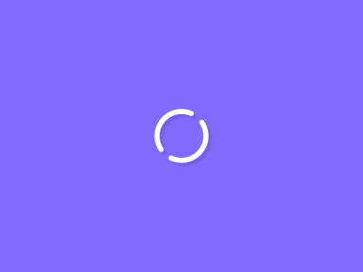
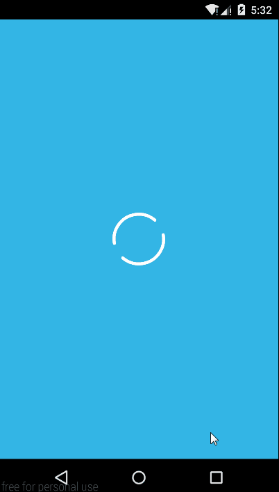

Loading
================
RotateLoading is a nice progressbar.

Supported on API Level 11 and above.

The idea was inspired by this gif.




Usage
====
Add RingButton to your xml.
```
  <com.victor.loading.RotateLoading
        android:id="@+id/rotateloading"
        android:layout_width="80dp"
        android:layout_height="80dp"
        app:loading_width="5dp"
        android:layout_centerInParent="true"/>

```
When startAnimator() is called, the view of loading will show.
When stopAnimator() is called, the view of loading will disappear.


License
=======
Copyright 2015 yankai-victor

Licensed under the Apache License, Version 2.0 (the "License"); you may not use this work except in compliance with the License.
You may obtain a copy of the License in the LICENSE file, or at:

http://www.apache.org/licenses/LICENSE-2.0

Unless required by applicable law or agreed to in writing, software distributed under the License is distributed on an "AS IS" BASIS, WITHOUT WARRANTIES OR CONDITIONS OF ANY KIND, either express or implied. See the License for the specific language governing permissions and limitations under the License.
